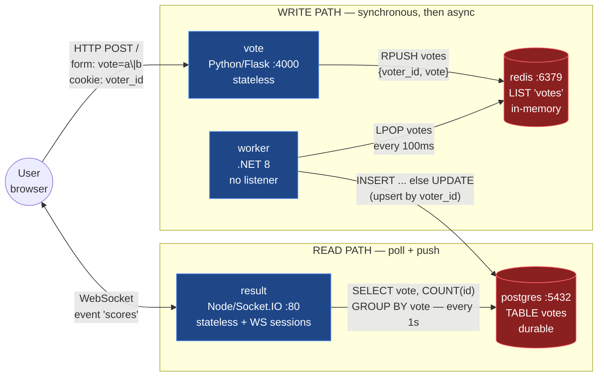
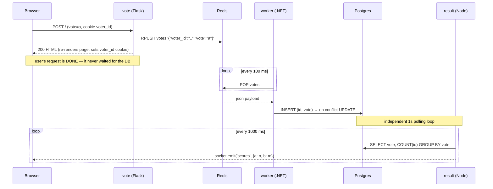

# Voting App — Architecture & DevOps Reference

> Purpose: everything a DevOps/SRE engineer needs to understand this system well enough to
> deploy it as a highly-available workload on Kubernetes. This document describes the
> **application** — its components, contracts, state, and failure behaviour. It deliberately
> does not prescribe manifests; it gives you the facts and constraints you need to write them
> correctly.

---

## Start here

**You do not need to read this whole document to deploy the app.** It is written to be used in
three passes.

**Pass 1 — to write working manifests, read these five things:**

| Read | Why |
|---|---|
| §2 Component inventory | ports, protocols and dependencies — the direct inputs to your Deployments and Services |
| §3 Topology | the write path and read path are separate and never touch |
| §4.4 Configuration contract | the exact env vars for your ConfigMap and Secret |
| §5 HA matrix | the one big idea: stateless tiers scale by replicas, stateful ones do not |
| §13 Local verification | prove your understanding against a running stack before touching a cluster |

**Pass 2 — read when you hit the specific problem:**
§6.1 when writing probes · §7 when setting requests/limits · §4.1–4.3 when votes stop counting
and you need to know where to look.

**Pass 3 — the deeper material**, worth returning to but not needed on day one:
§5.1 Sentinel/Patroni/operators · §6.2 delivery guarantees · §8 security · §9 CI/CD · §12
learning path.

**The five-line summary:**

1. `vote` (Python) takes a vote and `RPUSH`es it onto a Redis list. That's all it does.
2. `worker` (.NET) `LPOP`s from that list and upserts into Postgres. It listens on no port.
3. `result` (Node) polls Postgres once a second and pushes tallies over WebSocket.
4. `vote` and `result` **never talk to each other** — they are joined only by data at rest.
5. `vote`, `worker` and `result` are stateless and scale freely. Redis and Postgres are not,
   and scaling their replica count naively will silently destroy data.

---

## 1. What the system does (30 seconds)

Users vote between two options ("Cats" vs "Dogs"). Votes are accepted by a web front-end,
queued, processed asynchronously by a background worker, persisted to a relational database,
and streamed live to a results dashboard.

It is deliberately built as **five separate processes in three different languages**. That's
the point: it is a teaching rig for polyglot, multi-tier deployment — a synchronous web tier,
an async message-driven tier, an in-memory datastore, and a durable datastore. Each tier has
a *different* scaling and availability story, and that is the real lesson.

---

## 2. Component inventory

| # | Component | Language / Runtime | Role | Listens on | Talks to | Holds state? |
|---|-----------|-------------------|------|-----------|----------|--------------|
| 1 | `vote` | Python 3.11 / Flask + Gunicorn | Vote submission UI + write API | TCP **4000** (HTTP) | Redis (write) | No — stateless |
| 2 | `redis` | Redis (alpine) | Work queue / buffer between web and worker | TCP **6379** | — | **Yes** — in-memory queue |
| 3 | `worker` | .NET 8 / C# console app | Queue consumer, writes to DB | **nothing** (no server socket) | Redis (read), Postgres (write) | No — but holds in-flight work |
| 4 | `db` | PostgreSQL | System of record for tallied votes | TCP **5432** | — | **Yes** — durable data |
| 5 | `result` | Node.js 22 / Express + Socket.IO | Live results dashboard | TCP **80** (`PORT` env) | Postgres (read) | No — but holds WebSocket sessions |

Supporting files: `docker-compose.yml` (local verification lab — see §13), `Jenkinsfile` (CI),
`helm/votingapp-charts` and `kubernetes/` (deployment — your work in progress).

### Dependency versions that matter

| Component | Pinned deps |
|---|---|
| `vote` | `Flask==3.1.3`, `redis==8.1.0`, `gunicorn==26.0.0` — exact pins, reproducible builds |
| `result` | `express ^4.18`, `socket.io ^4.7`, `pg ^8.8`, `async ^3.1`, `cookie-parser ^1.4` — caret ranges, so a `package-lock.json` is what actually makes these reproducible |
| `worker` | `StackExchange.Redis 2.2.4`, `Npgsql 4.1.9` (⚠️ see §8), `Newtonsoft.Json 13.0.1`, targets `net8.0` |

---

## 3. How they connect — the topology



**The critical structural fact:** there is **no direct communication between `vote` and
`result`**. They are coupled only through data at rest (Redis → worker → Postgres). That
decoupling is what lets you scale, restart, and fail each tier independently — and it's also
why "the vote button works but the numbers don't move" has three possible root causes, not one.

### Sequence of a single vote



End-to-end latency from click to dashboard update: **~100ms (worker poll) + up to 1s (result
poll)**. Perceived lag of up to ~1.1s is normal and *not* a bug.

---

## 4. The integration contracts

These are the real interfaces. Break one and the system fails silently — no compiler will
catch it. Treat them as API contracts under change control.

### 4.1 Redis queue contract (`vote` → `worker`)

- **Key:** `votes` (Redis LIST, database index `REDIS_DB`, default `0`)
- **Producer:** `vote` does `RPUSH` (append to tail) — `vote/app.py:50`
- **Consumer:** `worker` does `LPOP` (pop from head) — `worker/Program.cs:48`
- **Payload:** `{"voter_id": "<hex string>", "vote": "a" | "b"}`
- **Semantics:** FIFO queue. `LPOP` is atomic, so **multiple worker replicas are safe** — this
  is a textbook *competing consumers* pattern. No two workers can pop the same item.
- **Durability:** **none unless you configure it.** A stock Redis image is in-memory only, so a
  restart drops every unprocessed vote. `docker-compose.yml` enables `--appendonly yes` onto a
  named volume; do the equivalent in the cluster or accept the loss window knowingly. See §13.3
  experiment G to watch both behaviours.

### 4.2 Postgres contract (`worker` → `db` → `result`)

Schema is created **by the worker at startup**, not by a migration tool
(`worker/Program.cs:143-147`):

```sql
CREATE TABLE IF NOT EXISTS votes (
    id   VARCHAR(255) NOT NULL UNIQUE,   -- the voter_id cookie
    vote VARCHAR(255) NOT NULL           -- 'a' or 'b'
);
```

- **Write pattern (`worker/Program.cs:192-199`):** try `INSERT`; on any DB exception, fall back
  to `UPDATE votes SET vote=@vote WHERE id=@id`. This is a hand-rolled upsert keyed on the
  unique voter id. Consequence: **one vote per browser cookie, and a voter can change their
  vote.** This also makes vote processing *idempotent* — replaying the same message twice
  produces the same final state.
- **Read pattern (`result/server.js:51`):** `SELECT vote, COUNT(id) AS count FROM votes GROUP BY vote`
- **Migration ownership:** the worker owns DDL. Three implications:
  1. **The worker must reach a writable Postgres before anything works** — it cannot be pointed
     at a read replica, and on a fresh database nothing functions until it has started once.
  2. Two workers racing on `CREATE TABLE IF NOT EXISTS` at cold start is benign but noisy.
  3. **`result` queries a table it does not create.** On a brand-new database, if `result`
     starts before `worker` has run its DDL, it logs `relation "votes" does not exist` once per
     second until the worker catches up. Harmless and self-correcting — the 1s poll retries
     forever — but it looks alarming in logs on first deploy, and it is a genuine startup-order
     coupling that no readiness probe on `result` can express.

### 4.3 Browser contract (`result` → user)

- Socket.IO v4 server. Client emits `subscribe`, server does `socket.join(channel)`, but the
  actual broadcast is `io.sockets.emit("scores", ...)` — i.e. **broadcast to all connected
  clients on that replica**, rooms are effectively unused.
- Payload: `{"a": <int>, "b": <int>}`, JSON-stringified.

### 4.4 Configuration contract — every connection detail is an environment variable

All backing-service addresses and credentials are read from the environment at startup. Nothing
is hardcoded. **The defaults reproduce the original single-host behaviour**, so an unconfigured
run still works — but in Kubernetes you supply every value explicitly, and `docker-compose.yml`
deliberately overrides all of them so that a successful local run proves the wiring (see §13.1).

The split below is the intended one: **non-sensitive values → ConfigMap, passwords → Secret.**

| Variable | Consumed by | Default | Source |
|---|---|---|---|
| `REDIS_HOST` | `vote`, `worker` | `redis` | ConfigMap |
| `REDIS_PORT` | `vote`, `worker` | `6379` | ConfigMap |
| `REDIS_DB` | `vote` | `0` | ConfigMap |
| `REDIS_PASSWORD` | `vote`, `worker` | *(unset = no auth)* | **Secret** |
| `POSTGRES_HOST` | `worker`, `result` | `db` | ConfigMap |
| `POSTGRES_PORT` | `worker`, `result` | `5432` | ConfigMap |
| `POSTGRES_DB` | `worker`, `result` | `postgres` | ConfigMap |
| `POSTGRES_USER` | `worker`, `result` | `postgres` | ConfigMap |
| `POSTGRES_PASSWORD` | `worker`, `result` | `postgres` | **Secret** |
| `OPTION_A` / `OPTION_B` | `vote` | `Cats` / `Dogs` | ConfigMap |
| `PORT` | `result` | `4000` | ConfigMap |

Which service needs what:

- **`vote`** → Redis vars + `OPTION_A`/`OPTION_B`. Never touches Postgres.
- **`worker`** → Redis vars + Postgres vars. Needs both.
- **`result`** → Postgres vars + `PORT`. Never touches Redis.

Notes that matter when wiring this up:

- **`REDIS_PASSWORD` is opt-in.** If unset or empty, both clients connect with no `AUTH`, which
  is exactly the old behaviour. Set it *and* configure the Redis server to require it
  (`--requirepass`) — setting only one side breaks the connection.
- **The same `POSTGRES_PASSWORD` Secret must be consumed by three places**: `worker`, `result`,
  and the Postgres container's own `POSTGRES_PASSWORD` (which is what *sets* the password at
  first init). If they drift, the app can't authenticate. Note that changing the Secret later
  does **not** change the password of an already-initialised database — Postgres only reads
  `POSTGRES_PASSWORD` on an empty data directory.
- **Passwords with special characters are safe.** Credentials are passed as discrete fields
  (`NpgsqlConnectionStringBuilder` in the worker, a `Pool` config object in `result`) rather
  than interpolated into a URL, so `@`, `:`, `/` and friends don't need escaping. Verified with
  the password `p@ss:word/1`.
- **The old hostname coupling is gone.** `db` and `redis` are now just defaults, not
  requirements — which resolves the mismatch with the `db-service` / `redis-service` Service
  names in `kubernetes/`. Either point `POSTGRES_HOST` / `REDIS_HOST` at your actual Service
  names, or keep the Service names as `db` / `redis` and set nothing. Both work now.
- If you use a cross-namespace or external endpoint, the value is just the FQDN —
  e.g. `POSTGRES_HOST=db-service.voting.svc.cluster.local`.

---

## 5. State, scaling, and the HA matrix

This is the heart of the exercise. **"HA" means different things per tier**, and the naive
move — bump `replicas` — is correct for two components, harmless-but-subtle for one, and
*actively data-destroying* for two.

| Component | Scale out by replicas? | Why |
|---|---|---|
| `vote` | ✅ **Yes, freely** | Fully stateless. No session state server-side (voter identity lives in a browser cookie). Any replica can serve any request. Gunicorn already runs 4 workers per pod, so a pod is internally concurrent too. |
| `worker` | ✅ **Yes** | `LPOP` is atomic → competing consumers. N workers = N× throughput, no coordination needed. Caveat: at-most-once delivery (see §6.2). |
| `result` | ⚠️ **Yes, with a caveat** | Each replica independently polls the DB and pushes to *its own* connected sockets. Since all replicas read the same source of truth, no cross-replica message bus (Socket.IO Redis adapter) is needed — a rare case where a WebSocket app scales without one. **But** Socket.IO's default transport starts with HTTP long-polling, which requires **session affinity / sticky sessions** at the ingress and Service layer, or the handshake will bounce between replicas and fail. Fix either by enabling affinity or by forcing `transports: ['websocket']` on the client. Also: N replicas × 1 query/sec = N queries/sec against Postgres, forever, even with zero users. |
| `redis` | ❌ **NO — do not scale a plain Deployment** | Redis replicas are **read-only** and each plain-Deployment pod would be an *independent, empty* Redis. Behind one Service, `vote` would scatter `RPUSH`es across N unrelated queues and each `worker` would drain only whichever one it landed on. Votes would be silently lost and processing would be nondeterministic. |
| `db` | ❌ **NO — do not scale a plain StatefulSet** | Same trap, worse consequences. Three Postgres pods with three PVCs = three independent databases. `worker` writes to one, `result` reads from another, and the dashboard shows the wrong numbers. Postgres has a single writable primary, period. |

### 5.1 What real HA looks like per tier

**Stateless tiers (`vote`, `result`, `worker`)** — HA here is standard and entirely within your
control:
- ≥2 (ideally 3) replicas so a node drain never means zero capacity
- spread across nodes and availability zones (anti-affinity / topology spread)
- a disruption budget so voluntary evictions can't take them all down at once
- readiness gating so traffic only reaches pods that can actually serve
- resource requests set, so the scheduler can honour the spread and the pods aren't first to be
  evicted under pressure
- rolling updates with surge, so there's no capacity dip during deploys

**Redis** — you have three honest options, in increasing order of effort:
1. **Single replica + persistence (AOF/RDB) on a PVC.** Not HA — you accept a ~30s outage
   window during pod reschedule. Because `vote`'s Redis client has a 5s socket timeout and no
   retry, votes submitted during that window return errors to users. Perfectly acceptable for a
   learning environment; be honest about calling it "durable", not "highly available".
2. **Redis Sentinel (primary + replicas + automatic failover).** The blocker: **Sentinel needs a
   Sentinel-aware client** — one that asks Sentinel "who is the primary right now?" — and
   neither `vote` (plain `Redis(host=...)`) nor `worker` does that. You'd need a proxy in front,
   or code changes. *(The worker used to make this worse by resolving the hostname to a raw IP
   before connecting, an old StackExchange.Redis workaround; it now connects by hostname, so at
   least DNS-based endpoint changes are followed correctly.)*
3. **Managed Redis / operator-based cluster** with a stable single endpoint that hides failover
   from the client. This is what production actually does, and it requires no app change because
   the endpoint name stays constant.

**Postgres** — same shape of answer:
1. **Single StatefulSet + PVC.** Durable, not HA. Failover = reschedule time + WAL recovery.
2. **Streaming replication with automated failover** — an operator (CloudNativePG, Zalando/Patroni,
   Percona). The operator publishes a stable "primary" Service; the app keeps using one hostname
   and never learns a failover happened. Because the app needs nothing beyond a single stable
   endpoint, this drops in cleanly — the right choice here.
3. **Managed database** (RDS/Cloud SQL) — you exit the HA business entirely.
   *Note:* `result` only ever reads. On a replicated setup it can point at a read replica and
   take polling load off the primary — and since `POSTGRES_HOST` is now an environment variable,
   that's a one-line config change, not a code change.

> **The general principle to internalise:** for stateless tiers, availability is a *scheduling*
> problem you solve with replicas and spreading. For stateful tiers, availability is a
> *consensus and failover* problem you solve with a purpose-built controller — and the client
> library has to cooperate. You cannot get stateful HA from `replicas: 3`.

---

## 6. Failure modes — what actually happens when things break

Know these before you write probes; they determine what "healthy" even means.

### 6.1 Retry and reconnect behaviour already in the code

**Startup and runtime behave completely differently**, and conflating them leads to the wrong
probe design. Both columns below were verified experimentally, not inferred from reading:

| Component | Dependency not yet up **at startup** | Dependency disappears **at runtime** |
|---|---|---|
| `worker` | Infinite retry loop — `Waiting for db` / `Waiting for redis` every 1s. Waits forever, never gives up. | **Crashes.** The idle keepalive `SELECT 1` raises `Npgsql.PostgresException 57P01`, which escapes the main loop to the outer `catch` → `return 1` → process exits. Restarted by the restart policy, then re-enters the startup retry loop. |
| `result` | Retries the connect 1000× at 1s, then logs `Giving up` and **stays alive serving HTTP** while never emitting scores. | **Crashes.** `pg` emits an `'error'` event on the idle client with no handler attached → `throw er` → uncaught exception → process exits. Restarted by the restart policy. |
| `vote` | Lazy — connects on first vote, so it starts fine with Redis down. | **No retry.** The exception surfaces inside the request → HTTP 500. The 5s `socket_timeout` bounds how long the user waits. |

**The headline:** for the two services that talk to Postgres, resilience is delivered by
**crash-and-restart**, not by in-process recovery. That is a perfectly legitimate design — the
process dies fast and clean rather than limping — but it changes what you should expect and
alert on:

- **A Postgres outage will show up as pod restarts on `worker` and `result`**, climbing steadily
  for as long as the outage lasts, and potentially `CrashLoopBackOff` once the backoff stretches.
  That is the system working as designed, not a bug in your manifests. Don't chase it; fix the DB.
- **Liveness probes are close to redundant** for these two. A liveness probe exists to catch a
  process that is wedged but still running; here the process reliably kills itself. An aggressive
  liveness probe adds nothing and risks killing `worker` during its legitimate startup wait.
- **Readiness probes still matter for `result`** — it binds its port and serves HTML before it
  has a working DB connection, so a naive TCP or `GET /` check reports green while the dashboard
  is dead. If you want readiness to mean "actually showing live results", it has to test more
  than the socket.
- **`worker` exposes no port**, so it can only be checked via an exec/process probe. Given it
  self-terminates on failure, the honest answer is that it barely needs one.
- **`vote`'s health is independent of Redis** — the page renders on `GET` without touching it. A
  readiness probe on `/` therefore measures the web tier only, and will happily report ready
  while every vote is failing with a 500.

### 6.2 Data-loss windows (be able to state these out loud)

1. **Redis is a non-durable queue.** With no persistence configured, a Redis restart drops the
   entire backlog. Votes vanish with no error surfaced to anyone.
2. **The worker is at-most-once.** It does `LPOP` (removes the item) and *then* inserts. If the
   worker dies between those two steps, **that vote is lost** — it's no longer in Redis and
   never reached Postgres. There is no acknowledgement, no in-flight/processing list, no
   `BRPOPLPUSH` reliable-queue pattern.
   **Graceful termination now closes the common case:** the worker handles SIGTERM, finishes the
   vote it is holding, and exits 0, so rolling updates and voluntary evictions no longer lose
   work — provided the grace period is long enough for one insert (it is; the window is
   milliseconds). What remains uncovered is *ungraceful* death: OOM-kill, node loss, SIGKILL.
   Closing that too would need the reliable-queue pattern, which is a larger code change.
3. **Postgres needs a PVC.** Without one, `emptyDir`/container-local storage means a pod restart
   resets the tally to zero. And because the DB is the only system of record — Redis is drained,
   not archived — a lost volume is unrecoverable.

### 6.3 Cascade behaviour

- **Redis down:** voting returns 500s; worker sits in its reconnect loop; **`result` carries on
  serving the tally, completely unaffected** — it never touches Redis. The dashboard looks
  perfectly healthy while the site is broken. This is why you monitor the *write path*, not just
  the dashboard.
- **Postgres down:** **voting still returns HTTP 200** — the write path terminates at Redis, so
  users notice nothing. Votes accumulate in the queue and are all processed once the DB returns
  (verified: §13.3 experiment H). Meanwhile `worker` and `result` both crash-restart in a loop
  (§6.1) and the tally freezes. If the outage is long, the queue grows unbounded → Redis memory
  pressure → the failure finally becomes user-visible in the worst possible way.
  **Redis queue depth is your single best leading indicator** for this system: it is the only
  signal that rises during a DB outage *before* anything user-facing breaks.
- **Worker down:** everything looks fine to users; votes just quietly stop counting and the queue
  grows. Silent, and the most likely failure to go unnoticed.
- **All `result` replicas down:** votes are counted correctly; only the dashboard is dark. Lowest
  business impact of any component — worth reflecting in how you prioritise its HA.

---

## 7. Resource and traffic profile

Useful for sizing requests/limits and setting autoscaling targets.

| Component | CPU shape | Memory shape | Notes |
|---|---|---|---|
| `vote` | Spiky, per-request | Small, flat (~4 Gunicorn workers) | Scales with user traffic. The natural HPA candidate. |
| `worker` | **Constant low baseline** | Small, flat | Polls every 100ms *unconditionally*, and when the queue is empty it runs `SELECT 1` as a DB keepalive — so it generates ~10 queries/sec at total idle. Never scales to zero usefully. Autoscaling on CPU is a poor fit; queue depth is the meaningful signal. |
| `result` | **Constant low baseline** | Grows with concurrent WebSocket connections | 1 DB query/sec **per replica** regardless of traffic. Connection count, not CPU, is the scaling signal. |
| `redis` | Low | **Grows with queue backlog** — the risk axis | Set `maxmemory` + an eviction policy deliberately; the default (no limit) lets a stuck worker OOM the node. |
| `db` | Low-moderate, read-dominated | Needs page cache | Read load = 1 q/s × `result` replicas. Write load = vote rate. Needs durable storage and a real backup story. |

**Idle-state load is non-zero and constant.** That surprises people: with zero users, this
system still does ~10 worker polls/sec plus 1 query/sec per `result` replica. Don't tune
autoscalers on CPU alone.

---

## 8. Security posture (facts, so you can decide what to fix)

- ✅ **Credentials now come from the environment**, not source — see the table in §4.4. A
  Kubernetes Secret is now load-bearing rather than decorative.
- ✅ **Redis authentication is supported.** Set `REDIS_PASSWORD` on `vote` and `worker` and
  `--requirepass` on the Redis server. Unset = no auth, so it's opt-in and backward compatible.
- ⚠️ **No TLS anywhere.** Redis `AUTH` sends the password in cleartext over the connection, and
  Postgres traffic is unencrypted too. In-cluster that's the common trade-off, but pair it with
  network policy so only the four legitimate edges can reach those ports at all.
- ⚠️ **`Npgsql 4.1.9` has a known high-severity advisory** (GHSA-x9vc-6hfv-hg8c) — surfaced as
  `NU1903` during the worker build. Upgrading the package is a separate change from the ones
  made here; worth scheduling.
- **All inter-service traffic is plaintext** within the cluster. Restricting who can talk to whom
  is a network-policy concern; note the actual required edges are narrow:
  `vote→redis`, `worker→redis`, `worker→db`, `result→db`. Nothing else. `worker` needs **no
  inbound access at all**.
- **`vote`'s templates load assets from external CDNs** (`vote/templates/index.html:11,29-30` —
  jQuery, Font Awesome, cdnjs) over `http://` in one case. Air-gapped or egress-restricted
  clusters will render an unstyled page, and it's a mixed-content/supply-chain exposure.
- **SQL injection:** the `INSERT` path is correctly parameterised. The `UPDATE` fallback reuses
  the same parameter collection, so it's also safe.
- `vote`'s `voter_id` cookie is set without `HttpOnly`/`Secure`/`SameSite` and is trivially
  forgeable — vote integrity is not a design goal here, but know it isn't one.

---

## 9. CI/CD as it stands

`Jenkinsfile` — six build/push stages (one pair per service) plus a deploy stage:

```
Build vote → Push vote → Build result → Push result → Build worker → Push worker → Deploy (helm upgrade --install)
```

Facts worth knowing:
- Images push to Docker Hub as `programmer175/voteapp_{vote,result,worker}`, tagged both
  `$BUILD_NUMBER` and `latest`.
- The deploy stage runs on a `kops`-labelled agent and does
  `helm upgrade --install votingapp-stack helm/votingapp-charts --set voteimage=...`.
- **The `--set` values pass repository names with no tag** — so the chart's rendered image
  reference resolves to `:latest`. That means the immutable `$BUILD_NUMBER` tag is built and
  pushed but never actually deployed, and deployments aren't reproducible or trivially
  rollback-able. Passing the build number through is the single highest-value CI improvement
  here.
- Builds are sequential; the three images are independent and could run in parallel.
- No test, lint, or image-scan stage exists (`result/package.json`'s `test` script exits 1 by
  design; `result/tests/` contains a `render.js` smoke test that CI never runs).

---

## 10. Code-level defects — all fixed

These were found while reading the source and have since been repaired. Recorded here because
each one *presents as an infrastructure problem*, so it's worth recognising the symptom if a
regression ever reintroduces one.

1. ✅ **`result` crashed on every startup.** A stray `x` after the `console.log` in the
   `server.listen` callback was an undefined identifier → `ReferenceError` the moment the
   server finished binding. Symptom in Kubernetes: `CrashLoopBackOff` on `result` with a
   perfectly valid image and port — hours lost blaming manifests. *Removed.*

2. ✅ **Every vote was pushed to Redis twice.** `rpush` was called once directly and again
   inside an `if`. The tally stayed correct (the upsert is idempotent on `voter_id`), but queue
   depth, worker load, and DB write volume were all 2× — corrupting the exact metrics you'd use
   for capacity planning and queue-depth autoscaling. *Now a single push whose return value
   drives the log line.*

3. ✅ **`path` was used but never required** in `result`. Masked because `express.static`
   serves `views/index.html` as the directory index before the route is reached — a latent
   crash waiting for someone to reorder the middleware. *`require('path')` added.*

4. ✅ **`worker` ignored SIGTERM.** The `while(true)` loop ran until SIGKILL, so every rolling
   update killed it mid-flight and lost any vote already `LPOP`'d but not yet inserted.
   *Now registers `PosixSignal.SIGTERM`/`SIGINT`, cancels the default terminate, finishes the
   in-flight vote, closes both connections, and exits 0.* Verified: `docker stop` produces
   exit code 0 and a clean `Shutdown complete` rather than a 137.

5. ✅ **`vote` dependencies were unpinned.** `Flask`, `Redis`, `gunicorn` with no versions meant
   two builds of the same commit could produce different images. *Pinned to `Flask==3.1.3`,
   `redis==8.1.0`, `gunicorn==26.0.0`.*

Two further defects were found and fixed while working in these files:

6. ✅ **`worker` silently dropped a vote whenever it reconnected to Postgres.** The DB-reconnect
   branch was an `if`/`else` against the insert, so on any iteration where the connection had
   dropped, the vote — already removed from Redis — was reconnected *instead of* written, never
   retried. *The insert now always runs after a reconnect.* The stale `keepAliveCommand` bound
   to the dead connection is rebuilt too.

7. ✅ **`vote`'s voter id lost its last hex character.** `hex(...)[2:-1]` was Python 2 code
   stripping a trailing `L` that Python 3 doesn't emit. *Now `[2:]`.*

**Verification performed:** all three images build; the full path was exercised end-to-end
against a password-protected Redis and a Postgres with non-default credentials, both on
non-default hostnames, with every setting supplied purely through environment variables —
vote accepted → exactly one queue entry → worker drained it → row in Postgres → `scores` event
delivered over the Socket.IO connection.

---

## 11. Deployment readiness checklist

Not manifests — the *decisions* to have made, each traceable to a section above.

**Correctness (blocking)**
- [x] ~~App code parameterised for hostnames and credentials~~ — done (§4.4)
- [x] ~~`result`'s startup crash~~ — done (§10.1)
- [ ] **The local lab passes** — `docker compose up -d --build` and experiments A–H in §13.3
- [ ] ConfigMap supplies `REDIS_HOST` / `POSTGRES_HOST` etc. matching your actual Service names (§4.4)
- [ ] Secret supplies `POSTGRES_PASSWORD` to `worker`, `result`, **and** the Postgres container itself (§4.4)
- [ ] If using `REDIS_PASSWORD`, the Redis server is started with `--requirepass` to match (§4.4)
- [ ] Postgres has durable storage; a pod restart must not reset the tally (§6.2)

**Availability**
- [ ] ≥2 replicas each for `vote`, `result`, `worker`; spread across nodes/zones (§5.1)
- [ ] Redis and Postgres replica counts stay at 1 unless a real replication mechanism is in place (§5)
- [ ] Session affinity for `result`, or WebSocket-only transport (§5)
- [ ] Disruption budgets so drains and upgrades can't take a whole tier out (§5.1)
- [ ] Probe semantics match the actual failure modes — no aggressive liveness on `worker`,
      no shallow TCP check on `result` (§6.1)
- [ ] Alerting treats `worker`/`result` restarts during a DB outage as a *symptom*, not the
      incident — they crash-restart by design (§6.1)
- [ ] Termination grace period long enough for `result` to drain WebSockets; accept and document
      the worker's loss window (§6.2)

**Operability**
- [ ] Resource requests/limits set from the profile in §7 — including a `maxmemory` for Redis
- [ ] **Redis queue depth (`LLEN votes`) is monitored and alerted on** — the one metric that
      catches silent worker/DB failure (§6.3)
- [ ] Postgres backups exist and a restore has actually been tested
- [ ] Network paths restricted to the four real edges; `worker` has no ingress (§8)
- [ ] CI deploys the immutable `$BUILD_NUMBER` tag, not `latest` (§9)

---

## 12. Suggested learning path through this system

If the goal is skill-building rather than just a green deploy, tackle it in this order — each
step teaches one idea and depends only on the ones before it:

1. **Run the local lab first (§13)** and work through experiments A–H. Twenty minutes here saves
   hours of cluster debugging, because you learn what *correct* looks like before anything can
   be blamed on Kubernetes. *Lesson:* verify the application and the platform separately.
2. **Make it durable.** Persistent storage for Postgres, then Redis. Kill the pods and prove the
   data survives. *Lesson:* durability ≠ availability.
3. **Make the stateless tiers HA.** Scale, spread, budget, probe. Drain a node and watch traffic
   keep flowing. *Lesson:* what replicas actually buy you.
4. **Break `result` on purpose** by scaling it to 3 with long-polling and no affinity. Watch the
   handshakes fail. Then fix it. *Lesson:* stateful *connections* need affinity even when the
   *app* is stateless.
5. **Prove the queue decoupling in the cluster**, the way §13.3 experiment C does locally: kill
   the worker, keep voting, restart it, watch the backlog drain. Then `kubectl delete pod
   --force` it mid-drain and find the lost vote. *Lesson:* async decoupling buys resilience,
   graceful shutdown covers planned disruption, and only a reliable-queue pattern covers the
   unplanned kind.
6. **Make the data tiers HA properly** with an operator. *Lesson:* stateful HA is a controller's
   job, not a replica count's.
7. **Close the CI loop:** immutable tags, real rollbacks, then progressive delivery.
   *Lesson:* deployability is part of availability.

---

## 13. Local verification lab

`docker-compose.yml` is not just "run the app locally" — it is a **rig for proving the
behaviours described in this document**, and every experiment below maps to a section above.
Run these before you trust a cluster deployment; a failure here is far cheaper to diagnose.

### 13.1 Why the compose file uses non-default values everywhere

The stack deliberately uses service names `redis-service` / `db-service` (matching the
Kubernetes Services), Postgres credentials `voteuser` / `votesdb`, a password containing
`@ : /`, and a Redis password. **This makes the test falsifiable.** If the application were
still falling back to its built-in defaults, it would look for a host named `db` that does not
exist in this network and fail immediately. A stack that comes up is therefore *proof* the
environment variables are being read, not just evidence that nothing crashed.

It also builds from source (`build:`) rather than pulling `programmer175/voteapp_*` from Docker
Hub, so it exercises your working tree instead of someone's old image.

### 13.2 Start it

```bash
docker compose up -d --build
```

Vote at <http://localhost:4000>, results at <http://localhost>. Tear down with
`docker compose down -v` (the `-v` also drops the Postgres and Redis volumes).

Note the `depends_on: condition: service_healthy` gating — `vote`, `worker` and `result` do not
start until Redis and Postgres report healthy. That is the compose equivalent of readiness
gating, and it is why startup is ordered rather than a race.

### 13.3 Experiments, and what each one proves

**A. The write path end to end** *(§3, §4.1, §4.2)*
```bash
curl -X POST -d "vote=a" --cookie "voter_id=alice" http://localhost:4000/
docker compose exec db-service psql -U voteuser -d votesdb -c "SELECT * FROM votes;"
```
A row appears within about a second. You have just traversed all five components.

**B. Queue depth is 1 per vote, not 2** *(§10.2)*
```bash
docker compose stop worker
curl -X POST -d "vote=a" --cookie "voter_id=bob" http://localhost:4000/
docker compose exec redis-service redis-cli -a 's3cr3t-redis-pw' --no-auth-warning LLEN votes
```
Expect `1`. Before the double-push fix this printed `2` — which is why queue depth used to be
useless as an autoscaling signal.

**C. The queue decouples the tiers** *(§3, §6.3)*
```bash
docker compose stop worker
for v in carol dave erin; do curl -sX POST -d "vote=a" --cookie "voter_id=$v" http://localhost:4000/; done
docker compose exec redis-service redis-cli -a 's3cr3t-redis-pw' --no-auth-warning LLEN votes   # 3
docker compose start worker && sleep 5
docker compose exec redis-service redis-cli -a 's3cr3t-redis-pw' --no-auth-warning LLEN votes   # 0
```
Voting keeps working with the worker completely down; the backlog drains on restart. **This is
the single most important behaviour to internalise** — it is why the worker can be updated,
rescheduled, or scaled with no user-visible impact, and equally why a dead worker is invisible
to users and must be caught by monitoring queue depth.

**D. Graceful shutdown** *(§6.2, §10.4)*
```bash
docker compose stop worker
docker inspect -f '{{.State.ExitCode}}' worker    # 0, not 137
docker compose logs worker | tail -3
```
`Shutdown complete, no vote in flight`. Exit code `0` means SIGTERM was handled; `137` would
mean it was SIGKILLed after the grace period, losing whatever it held. This is exactly what
happens on every Kubernetes rolling update.

**E. The upsert, not a double count** *(§4.2)*
```bash
curl -X POST -d "vote=b" --cookie "voter_id=alice" http://localhost:4000/
docker compose exec db-service psql -U voteuser -d votesdb -c "SELECT vote, COUNT(id) FROM votes GROUP BY vote;"
```
Alice's vote *moves* from `a` to `b`; the total does not increase. One vote per browser cookie.

**F. Live push to the browser** *(§4.3)*
```bash
SID=$(curl -s "http://localhost/socket.io/?EIO=4&transport=polling" | sed 's/^0//' \
      | python3 -c "import sys,json;print(json.load(sys.stdin)['sid'])")
curl -s -o /dev/null -X POST -H 'Content-Type: text/plain' --data '40' \
     "http://localhost/socket.io/?EIO=4&transport=polling&sid=$SID"
curl -s -o /dev/null "http://localhost/socket.io/?EIO=4&transport=polling&sid=$SID"
curl -s --max-time 5 "http://localhost/socket.io/?EIO=4&transport=polling&sid=$SID"
```
Returns `42["scores","{\"a\":1,\"b\":1}"]`. Incidentally this is the long-polling handshake
that forces the **session-affinity requirement** discussed in §5 — note it takes several
round-trips bound to one `sid`, all of which must reach the same replica.

**G. Redis persistence** *(§6.2)*
```bash
docker compose stop worker
curl -sX POST -d "vote=a" --cookie "voter_id=frank" http://localhost:4000/
docker compose restart redis-service && sleep 3
docker compose exec redis-service redis-cli -a 's3cr3t-redis-pw' --no-auth-warning LLEN votes
```
The compose file enables `--appendonly yes`, so the vote survives. Remove that flag and rerun
to watch the backlog vanish — that is the default Redis behaviour, and the reason §6.2 calls it
a non-durable queue.

**H. Cascade behaviour when Postgres dies** *(§6.1, §6.3)*
```bash
docker stop db      # NOTE: raw docker, not `docker compose stop db-service` -- see below
curl -X POST -d "vote=a" --cookie "voter_id=grace" http://localhost:4000/   # still 200!
docker compose exec redis-service redis-cli -a 's3cr3t-redis-pw' --no-auth-warning LLEN votes
docker inspect -f '{{.RestartCount}}' worker result
docker start db     # everything recovers; the queued vote lands in the DB
```

> Use `docker stop db`, **not** `docker compose stop db-service`. Compose stops a service's
> dependents along with it, so the compose form takes `worker` and `result` down too and you
> observe nothing. This is itself a useful lesson: Kubernetes has no such dependency graph, so
> the raw form is the one that matches cluster behaviour.

Three things happen at once, and they are the most instructive result in this lab:

1. **Voting still returns 200.** The write path terminates at Redis, so the outage is invisible
   to users. The vote is queued and lands in Postgres when it returns.
2. **Queue depth rises.** This is the *only* signal that moves early — hence §6.3.
3. **`worker` and `result` both crash and restart** (watch `RestartCount` increment). They do not
   ride out the outage; they die and are restarted, then wait for the DB. In Kubernetes this
   looks like mounting restart counts and eventually `CrashLoopBackOff` — correct behaviour, not
   a manifest bug.

**Both the vote page and the dashboard return HTTP 200 throughout.** A shallow health check
would report the entire system green while no vote is being counted. That is the single most
important thing this lab teaches about what to alert on.

### 13.4 Mapping the lab to Kubernetes

| Compose construct | Kubernetes equivalent |
|---|---|
| `environment:` under `# --- ConfigMap ---` | `envFrom` a ConfigMap |
| `environment:` under `# --- Secret ---` | `envFrom` / `secretKeyRef` a Secret |
| `healthcheck:` | readiness / liveness probes |
| `depends_on: condition: service_healthy` | no direct equivalent — pods must tolerate dependencies being absent, which is why the retry loops in §6.1 matter |
| `stop_grace_period: 30s` | `terminationGracePeriodSeconds` |
| named volumes | PersistentVolumeClaims |
| service name (`db-service`) | Service DNS name |

The fourth row is the important one: **compose lets you order startup, Kubernetes does not.**
In a cluster, `worker` *will* start before Postgres is ready, and the only thing saving you is
the application's own retry loop. Compose's `depends_on` hides a failure mode that Kubernetes
will expose.

---

*Sources: `vote/app.py`, `worker/Program.cs`, `result/server.js`, `result/views/app.js`,
`vote/templates/index.html`, `docker-compose.yml`, `Jenkinsfile`, `vote/requirements.txt`,
`result/package.json`, `worker/Worker.csproj`. Diagrams render on GitHub and in Mermaid-aware
viewers.*
