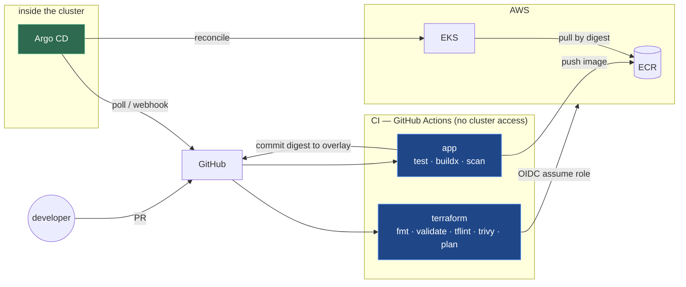

# CI/CD Design — GitHub Actions + Argo CD + EKS

Plan and reasoning for the delivery pipeline. Written as a reference, not a tutorial —
the *why* matters more than the YAML.

---

## 1. The one rule that determines everything

> **CI pushes artifacts. CD pulls state. CI never holds cluster credentials.**

The only integration point between them is **a git commit**.

CI runs untrusted code from pull requests — it is the most attacked surface you own. If CI
holds `kubectl` credentials to production, then compromising CI compromises production.
GitOps inverts this: Argo CD runs **inside** the cluster and pulls. Nothing outside the
cluster needs a way in.

Every other decision below follows from that one.

---

## 2. Architecture



Note the direction of the Argo arrow. **It points outward.** Nothing reaches into the
cluster.

---

## 3. Two pipelines, genuinely different

### 3.1 Terraform pipeline

Infrastructure cannot be GitOps in the Argo sense — Argo CD does not reconcile Terraform.
So this one is a conventional pipeline, with gates.

| Trigger | Steps |
|---|---|
| **PR opened** | `terraform fmt -check` · `validate` · `tflint` · `trivy config` · `terraform plan` |
| | plan output posted as a **PR comment** for a human to read |
| **Merge to main** | `terraform apply` — dev automatic, prod behind a GitHub Environment approval |

**Auth: GitHub OIDC → assume an AWS IAM role.** No stored access keys anywhere. This is
the change that turns "we have secrets in CI" into "we have no secrets in CI".

**Always `plan -out=tfplan` then `apply tfplan`.** Applying a saved plan guarantees you
apply exactly what was reviewed; a bare `apply` re-plans and the world may have moved.

### 3.2 Application pipeline

| Trigger | Steps |
|---|---|
| **PR opened** | lint · unit tests · build · `trivy image` scan |
| **Merge to main** | `docker buildx` multi-arch → push to ECR → **capture the digest** |
| | `kustomize edit set image` on the dev overlay |
| | commit the change |
| **Then** | Argo CD notices the commit and syncs |

The pipeline **ends at a git commit**. It never runs `kubectl`.

---

## 4. Digests, not tags

A tag can be repointed at different content. A digest **is** the content.

Without digests, *"which code is running in production?"* has no truthful answer. It also
closes a TOCTOU gap — the thing you scanned and the thing you deployed are provably
identical.

```bash
# after buildx --push
DIGEST=$(docker buildx imagetools inspect "$ECR_REPO:$GITHUB_SHA" \
         --format '{{.Manifest.Digest}}')

cd kubernetes/overlays/dev
kustomize edit set image programmer175/voteapp_vote="$ECR_REPO@$DIGEST"

git commit -am "dev: vote -> ${DIGEST:0:19}"
git push
```

`kustomize edit set image` rewrites the `images:` block in `kustomization.yaml` in place.
That commit **is** the deployment.

> **Multi-arch is not optional here.** A local Mac is `arm64`; the EKS node group is
> `t3.medium` / `AL2023_x86_64_STANDARD`, which is `amd64`. Build both or the first real
> deploy fails with `exec format error`.
>
> ```bash
> docker buildx build --platform linux/amd64,linux/arm64 --push -t "$ECR_REPO:$SHA" ./vote
> ```

---

## 5. Branching and promotion

### 5.1 Do not branch per environment

The obvious-looking design — `develop` deploys dev, `stage` deploys stage, `master` deploys
prod — is a **documented GitOps anti-pattern**. From the platform-engineering write-up:

> *"Using Git branches to represent environments is considered an anti-pattern. Branch-based
> promotion creates merge conflicts, makes it hard to see what's deployed where, and violates
> trunk-based development."*

Four concrete reasons:

| Problem | Why it happens |
|---|---|
| **Branches drift permanently** | `overlays/prod` has 3 replicas and ALB annotations; on `develop` it has 2 and nginx. The branches differ *by design*, so they can never be fast-forwarded and every merge carries hand-resolved conflicts. |
| **Promotion becomes a merge** | A merge brings everything that differs, not just the artifact you meant to promote. You lose the guarantee that what shipped is what was tested. |
| **"What's in prod?" needs a branch diff** | Instead of reading one file. |
| **Hotfixes travel backwards** | Fix on `main`, then merge prod → stage → develop. This is where most branching strategies quietly collapse. |

### 5.2 The distinction that resolves it

Two different things get branched, and they are not the same problem:

| What | Branching answers | Correct mechanism |
|---|---|---|
| **Application code** | is this code ready? | your choice — trunk-based or GitFlow |
| **Deployment config** | what runs where? | **directories, not branches** |

`kubernetes/overlays/{dev,stage,prod}` **is** the environment separation. Adding branches on
top gives you two mechanisms for one job, and they will eventually disagree.

### 5.3 The recommended model

**One long-lived branch: `main`.** Short-lived feature branches, PR, merge, delete.

```
feature/xyz ──PR──► main
                     │
                     ├─ CI: build · scan · push to ECR · capture digest
                     ├─ CI: update overlays/dev      ──► Argo syncs dev
                     │
                     ├─ PR: same digest → overlays/stage   ──► Argo syncs stage
                     │
                     └─ PR: same digest → overlays/prod    ──► Argo syncs prod
                             (GitHub Environment approval required)
```

**Never rebuild for production.** The exact artifact tested in dev is the one that ships.
Promotion is a digest moving between overlay files — a one-line diff — not a new build.
That is only possible because the reference is a digest, not a tag.

The prod PR *is* the change record: who approved, when, and exactly what moved. `git log
kubernetes/overlays/prod/` becomes a complete deployment history, and rollback is
`git revert`.

### 5.4 Gating on path, not branch

The thing branch-per-environment was reaching for — "merging here deploys there" — is better
expressed as a path filter plus a protected GitHub Environment:

```yaml
# .github/workflows/promote-prod.yml
on:
  pull_request:
    paths:
      - 'kubernetes/overlays/prod/**'

jobs:
  validate:
    environment: prod        # requires reviewers configured in repo settings
```

This is stronger than branch protection because it is scoped to **what changed** rather than
**where it landed**. A change to the prod overlay cannot merge without approval, enforced by
GitHub rather than by convention.

### 5.5 If you still want `develop`

Legitimate — but as an **integration branch for release cadence**, not as a deployment target:

```
feature/* → develop → main
              │         │
              │         └─ CI updates overlays/dev, then PRs to stage and prod
              └─ nothing deploys from here
```

Use it if you batch releases. Do not wire it to a cluster.

### 5.6 The known failure mode

Teams push promotion logic into CI until it becomes, quoting the Akuity write-up, *"a web
of duct-taped jobs and scripts that no one fully understands"* — one job tweaks a manifest,
a script opens a PR, another pipeline pushes a tag.

The modern answer is **[Kargo](https://akuity.io/blog/how-kargo-fixes-gitops-with-promotion)**,
from the Argo CD creators, which treats promotion as a first-class concern rather than glue.
Worth knowing it exists. Not worth adding to a small project.

---

## 6. One repo or two?

| | Pros | Cons |
|---|---|---|
| **Two repos** (app + gitops config) | Clean separation of "what the code is" from "what is deployed"; different access controls; CI's commit cannot re-trigger CI | More moving parts |
| **One repo** | Simpler, everything in one place | The bot's overlay commit re-triggers CI unless excluded |

**Recommendation for this project: one repo**, with `paths-ignore` on `kubernetes/overlays/**`
so the digest commit does not loop:

```yaml
on:
  push:
    branches: [main]
    paths-ignore:
      - 'kubernetes/overlays/**'   # CI's own digest commit must not retrigger CI
      - '**/*.md'
```

Know that two repos is the answer at scale, and why. Note that the loop problem disappears
entirely with two repos, which is one of the reasons the split exists.

---

## 7. How a company like Apple would do this

Same shape, built in-house — the IS&T job description says *"building and scaling custom
deployment tools ... across multi-cloud environments"*, which is precisely this system.

Layered on top:

- **Image signing** — cosign/Sigstore, with an admission controller refusing unsigned
  images. GitHub OIDC issues short-lived signing certificates; signatures land in a public
  append-only transparency log.
- **SLSA provenance** — a signed attestation describing *how* the image was built, stored
  alongside it in the OCI registry.
- **SBOM per image** — so "are we exposed to CVE-X" is a query, not an investigation.
- **Separation of duties** — Apple Pay is PCI scope, so whoever writes the code cannot be
  whoever approves the production promotion. An audit requirement, not a preference.
- **Fleet-scale CD** — not one Argo Application per service, but ApplicationSets or a
  homegrown controller across hundreds of clusters, on-prem and cloud.
- **Trunk-based development**, near-universally. Large organisations run short-lived
  branches merged to one trunk behind feature flags, precisely to avoid the long-lived
  branch divergence described in §5.1.

---

## 8. Scope for a junior engineer

**You will not design this. You will consume it.**

Realistic first-year work:

- add a new service to the existing pipeline
- fix a flaky or slow build step
- add a scanning gate
- debug why an Argo sync is stuck in `Progressing`
- add an overlay for a new region or environment

**What you genuinely need to understand:**

| | |
|---|---|
| Why CI has no cluster credentials | the security model |
| What a digest is, and why not a tag | reproducibility and rollback |
| How to read Argo sync + health status | daily operational skill |
| How to roll back | `git revert` — the cluster follows |

Building a small version yourself is the best preparation, because you will recognise every
piece when you meet the real one.

---

## 9. Build order

| # | What | Effort | Needs AWS? |
|---|---|---|---|
| 1 | **Terraform CI** — fmt, validate, tflint, trivy on PR | ~2h | No, for validate |
| 2 | **App CI** — buildx multi-arch, push to ECR, digest, commit | ~3h | ECR (`20-workload`) |
| 3 | **Argo CD** — install on the **local** cluster, sync `overlays/dev` | ~3h | **No** |

### The trick for step 3

Install Argo CD on Docker Desktop rather than EKS. It watches the GitHub repo and syncs
`overlays/dev` to the local cluster. **Zero AWS cost**, and it demonstrates exactly the same
pull-based model.

A working `git push → Argo syncs → pods roll` loop on a laptop is a better demonstration
than a half-finished EKS deployment, and it costs nothing to leave running.

---

## 10. Current gaps this closes

From `kubernetes/DECISIONS.md` and `terraform/DECISIONS.md`, the outstanding items are:

- ❌ everything applied by hand from a laptop → **fixed by 1 + 3**
- ❌ images referenced by mutable tag → **fixed by 2**
- ❌ no scanning gate → **fixed by 1 + 2**
- ❌ no audit trail on deployments → **fixed by 3** (every change is a commit)

Still open afterwards: image signing, SBOM, provenance, and secret management via External
Secrets Operator.

---

## Sources

- [GitOps Best Practices: A Complete Guide, 2026 Edition — Akuity](https://akuity.io/blog/gitops-best-practices-whitepaper)
- [GitOps Is Incomplete Without Promotion — How Kargo Fixes That](https://akuity.io/blog/how-kargo-fixes-gitops-with-promotion)
- [Argo CD Best Practices for CI/CD Integration](https://oneuptime.com/blog/post/2026-02-26-argocd-best-practices-cicd-integration/view)
- [GitOps architecture, patterns and anti-patterns — platformengineering.org](https://platformengineering.org/blog/gitops-architecture-patterns-and-anti-patterns)
- [Top 30 Argo CD Anti-Patterns To Avoid When Adopting GitOps — Octopus](https://octopus.com/blog/30-argo-cd-antipatterns-for-gitops)
- [GitOps Repository Structures and Patterns, Part 4: Promotion Patterns — Cloudogu](https://platform.cloudogu.com/en/blog/gitops-repository-patterns-part-4-promotion-patterns/)
- [10 GitOps Anti-Patterns You're Probably Making](https://medium.com/@DynamoDevOps/10-gitops-anti-patterns-youre-probably-making-and-how-to-fix-them-e511b947dd4c)
- [SLSA 3 Container Generator for GitHub Actions](https://slsa.dev/blog/2023/02/slsa-github-workflows-container-ga)
- [How to Push to AWS ECR with GitHub Actions](https://oneuptime.com/blog/post/2026-01-27-push-aws-ecr-github-actions/view)
