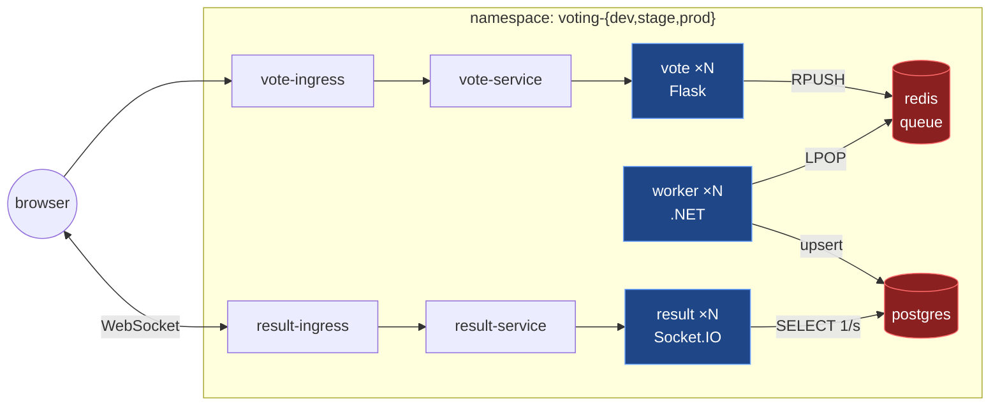

# voting-app — Kubernetes

Kustomize base plus three environment overlays. Nothing here is applied directly;
you always apply an overlay.

> **What is here vs. why it is here.** This file is *what exists and how to run it*.
> [DECISIONS.md](DECISIONS.md) is *why it was built this way* — read that second, and
> read it twice. Copying a layout is easy; defending it is the part that gets tested.

---

## 1. What gets deployed



**28 resources per environment:** 3 Deployments, 2 StatefulSets, 4 Services, 2 Ingresses,
3 PDBs, 1 HPA, 7 NetworkPolicies, 3 ConfigMaps, 2 Secrets, 1 Namespace.

`vote` and `result` never talk to each other. They are joined only by data at rest, which
is why a Redis outage breaks voting while the dashboard keeps serving a stale tally
perfectly happily. See [INCIDENT-001](../docs/incidents/).

---

## 2. Layout

```
kubernetes/
├── base/                        # complete app, no environment values
│   ├── kustomization.yaml
│   ├── config/*.env             # ConfigMap sources
│   ├── secrets/*.env            # Secret sources
│   └── *.yaml                   # 22 resource manifests
└── overlays/
    ├── dev/     kustomization.yaml + patches/
    ├── stage/   kustomization.yaml + patches/
    └── prod/    kustomization.yaml + patches/
```

Each overlay has three strategic merge patches:

| Patch | Changes |
|---|---|
| `scale.yaml` | replica counts, HPA bounds, PDB thresholds |
| `resources.yaml` | requests and limits, redis `maxmemory`, volume sizes |
| `ingress.yaml` | hostnames, ingress class, controller annotations |

---

## 3. Environments

| | dev | stage | prod |
|---|---|---|---|
| Namespace | `voting-dev` | `voting-stage` | `voting-prod` |
| vote / result / worker | 2 / 2 / 1 | 2 / 2 / 2 | 3 / 3 / 3 |
| HPA (vote) | 2–4 | 2–6 | 3–12 |
| PDB | `minAvailable: 1` | `minAvailable: 1` | `minAvailable: 2` |
| vote requests | 50m / 192Mi | 50m / 192Mi | 200m / 256Mi |
| postgres | 50m / 256Mi | 50m / 256Mi | 500m / 2Gi |
| redis `maxmemory` | 256mb | 256mb | 1gb |
| Storage | 1Gi `standard` | 1Gi `standard` | 20Gi / 10Gi `gp3` |
| Ingress | nginx, `*.local` | nginx, `*-stage.local` | **alb**, `*.example.com` |
| Images | `:local` | `:local` | `:1.0.0` |

Every `.yaml` in `base/` is identical for all three. If you ever need to edit the base for
one environment, that difference belongs in a patch.

---

## 4. Running it

```bash
# always inspect before applying — this renders without touching the cluster
kubectl kustomize overlays/dev

kubectl apply -k overlays/dev
kubectl get pods -n voting-dev -w
```

Prerequisites for the local cluster:

```bash
helm install ingress-nginx ingress-nginx/ingress-nginx -n ingress-nginx --create-namespace
kubectl apply -f https://github.com/kubernetes-sigs/metrics-server/releases/latest/download/components.yaml
kubectl patch deploy metrics-server -n kube-system --type=json \
  -p '[{"op":"add","path":"/spec/template/spec/containers/0/args/-","value":"--kubelet-insecure-tls"}]'
```

metrics-server is required for the HPA and for `kubectl top`. On Docker Desktop the
kubelet uses a self-signed cert, hence the patch.

### Reaching it

NodePort and LoadBalancer are both unreachable from the host on Docker Desktop, so:

```bash
sudo kubectl port-forward -n ingress-nginx svc/ingress-nginx-controller 80:80
# /etc/hosts:  127.0.0.1  vote.local results.local
```

Or without touching `/etc/hosts` — Ingress routes on the Host header:

```bash
kubectl port-forward -n ingress-nginx svc/ingress-nginx-controller 8080:80
curl -H "Host: vote.local" http://localhost:8080/
```

---

## 5. Verifying it actually works

Pods being `Running` proves very little — that was the lesson of both incidents. These are
the checks that mean something:

```bash
NS=voting-dev

# 1. does each pod have the config it needs? (a healthy pod with no env vars
#    silently uses built-in defaults and never processes anything)
kubectl exec -n $NS deploy/worker-deployment -- printenv | grep -E 'REDIS|POSTGRES' | sort

# 2. do the Services resolve to pods? (empty endpoints = a black hole that
#    looks perfectly healthy)
kubectl get endpointslice -n $NS

# 3. end to end: cast a vote, watch the queue drain, confirm the row lands
kubectl exec -n $NS redis-statefulset-0 -- \
  sh -c 'redis-cli -a "$REDIS_PASSWORD" --no-auth-warning LLEN votes'
kubectl exec -n $NS db-statefulset-0 -- \
  psql -U voteuser -d votesdb -c 'SELECT vote, COUNT(id) FROM votes GROUP BY vote;'

# 4. is NetworkPolicy actually enforced? vote must NOT reach the database
kubectl exec -n $NS deploy/vote-deployment -- python3 -c \
  "import socket;s=socket.socket();s.settimeout(5);s.connect(('db-service',5432))"
#   expected: TimeoutError

# 5. HPA has a real signal
kubectl get hpa -n $NS      # TARGETS must not read 0%/70% forever

# 6. actual usage vs what you reserved
kubectl top pods -n $NS
```

---

## 6. Troubleshooting

| Symptom | Cause |
|---|---|
| Pod `Running`, `Ready`, does nothing | Missing config. Run check 1 above. |
| `Waiting for db` forever | `voteapp-db-config` not in the workload's `envFrom` |
| Service reachable but nothing responds | Selector does not match pod labels — check 2 |
| `field is immutable` on apply | Selector changed. Delete and recreate the workload. |
| Ingress `admission webhook denied … already defined` | Another namespace claims that host + path |
| Everything breaks after adding NetworkPolicy | Missing the DNS egress rule |
| HPA stuck at `<unknown>` | metrics-server missing or failing TLS to the kubelet |
| HPA shows `2%/70%` and never scales | Requests too high — utilisation is a % of *request* |
| StatefulSet pods `Pending` | PVC cannot bind; check the StorageClass exists |
| Config edited but nothing changed | Env vars are read at container start. Use the generators. |

---

## 7. Deliberately not here

| Not here | Where it belongs |
|---|---|
| VPC, EKS, IAM, ECR | `terraform/` |
| `kubernetes`/`helm` Terraform providers | nowhere — see DECISIONS D-18 |
| Secret management | External Secrets Operator (gap) |
| Prometheus / Grafana | gap |
| CI/CD | gap — everything is applied by hand today |

The `helm/` chart that used to live here was deleted when this moved to kustomize. The
`Jenkinsfile` still references `helm upgrade` and is stale.
