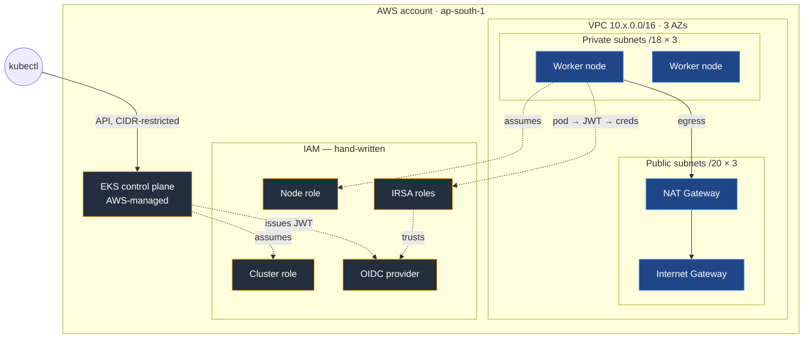

# voting-app — Infrastructure

Terraform for running the voting app on Amazon EKS across three environments.

> **New here?** Read this file for *what exists and how to run it*, then
> [DECISIONS.md](DECISIONS.md) for *why it is built this way*. The second file is the
> one worth reading twice — anyone can copy a Terraform layout, but being able to
> defend the choices is what a code review actually tests.

---

## 1. What this builds



**Resource counts per environment:** ~20 in `00-network`, ~35 in `10-platform`.

---

## 2. Layout

```
terraform/
├── README.md              ← you are here
├── DECISIONS.md           ← why it is built this way
├── Makefile               ← make plan DIR=live/dev/10-platform
├── bootstrap/             ← S3 state bucket. Run once, keeps local state.
│
├── modules/               ← all the logic (729 lines)
│   ├── vpc/               ← hand-written
│   ├── eks-iam/           ← hand-written: cluster role, node role
│   └── irsa/              ← hand-written: OIDC provider, IRSA roles
│
└── live/                  ← thin composition: module calls + values
    ├── dev/
    │   ├── 00-network/
    │   ├── 10-platform/
    │   └── 20-workload/   ← next: ECR, app IAM
    ├── stage/
    └── prod/              ← ⚠️ read live/prod/README.md first
```

### Two axes: environment × layer

Most tutorials vary only by environment. This varies by **environment and layer**, and
each cell is its own state file — six state files total.

| Layer | Contains | Changes | Blast radius |
|---|---|---|---|
| `00-network` | VPC, subnets, NAT, routing | almost never | everything |
| `10-platform` | EKS cluster, nodes, IAM, IRSA | occasionally | the cluster |
| `20-workload` | ECR, app IAM roles | weekly | one app |

The payoff: **a mistake in `20-workload` cannot produce a plan that destroys your
VPC**, because the VPC is not in that state file. Terraform literally cannot see it.
Plans stay fast, and later CI can auto-apply the workload layer while the network layer
requires a human.

Layers connect one-way via `terraform_remote_state` — read-only, downstream only.

### Environments are copies, and that is fine

Every `.tf` file is **identical** across `dev`, `stage` and `prod`. The only differences:

- the backend `key` in `versions.tf` (one line)
- `terraform.tfvars`

That duplication is cheap because `live/` is thin — `00-network/main.tf` is 34 lines of
module call. If you ever find yourself copying 200 lines of `resource` blocks into a new
environment, the module boundary is in the wrong place.

---

## 3. Environments

| | dev | stage | prod |
|---|---|---|---|
| VPC CIDR | `10.0.0.0/16` | `10.1.0.0/16` | `10.2.0.0/16` |
| NAT gateways | 1 | 1 | 3 |
| Nodes | 2 × t3.medium SPOT | 2 × t3.medium SPOT | 3 × t3.large ON_DEMAND |
| Secrets encryption (KMS) | off | off | on |
| Control plane logs | none | api, authenticator | all five |
| Log retention | 7d | 14d | 90d |
| **≈ cost/hour** | **$0.18** | **$0.18** | **$0.50** |
| **≈ cost/month** | **$128** | **$128** | **$365** |

*Approximate, ap-south-1, excluding data transfer.*

**CIDRs deliberately do not overlap.** They would work fine in isolation — right up
until someone wants VPC peering or a transit gateway, at which point overlapping ranges
make it impossible and you are renumbering a live environment.

---

## 4. Cost control — read before applying

The expensive things, per hour:

| Resource | $/hr | Notes |
|---|---|---|
| EKS control plane | 0.10 | charged even with zero nodes |
| NAT gateway | ~0.05 | **each**, plus data processing |
| t3.medium ON_DEMAND | ~0.042 | SPOT is ~70% less |
| Unattached Elastic IP | ~0.005 | bills for doing nothing |

**Destroy at the end of every session.** Platform first, then network:

```bash
make destroy DIR=live/dev/10-platform
make destroy DIR=live/dev/00-network
```

Then confirm nothing survived — this is the step people skip:

```bash
aws eks list-clusters
aws ec2 describe-nat-gateways --filter Name=state,Values=available --query 'NatGateways[].NatGatewayId'
aws ec2 describe-addresses --query 'Addresses[?AssociationId==null].AllocationId'
```

All three must be empty.

If your Terraform cannot rebuild the whole environment from nothing in ~20 minutes
unattended, it is not finished. Making that loop fast is the point, not a chore.

### Built-in guardrails

- **No KMS key in dev/stage.** A KMS key costs ~$1/month and **cannot be deleted
  immediately** — it enters a 7–30 day pending-deletion window while still billing.
  Nightly rebuild would strand a key every single day.
- **No audit logs in dev/stage.** Verbose and billed per GB ingested.
- **SPOT instances in dev/stage.** ~70% cheaper; an interruption costs nothing here.
- **`node_max_size`** caps what a runaway autoscaler can spend.
- **Log retention is never 0** (which means keep forever).
- **`prevent_destroy` on the state bucket** — deleting it would orphan every resource in
  every layer while AWS keeps billing.

---

## 5. Running it

### Once per account

```bash
terraform -chdir=bootstrap init
terraform -chdir=bootstrap apply      # creates the S3 state bucket
```

### Per environment

Order matters — the platform layer reads the network layer's state.

```bash
ENV=dev

terraform -chdir=live/$ENV/00-network init
terraform -chdir=live/$ENV/00-network plan -out=tfplan     # expect: 20 to add
terraform -chdir=live/$ENV/00-network apply tfplan

terraform -chdir=live/$ENV/10-platform init
terraform -chdir=live/$ENV/10-platform plan -out=tfplan    # expect: ~35 to add
terraform -chdir=live/$ENV/10-platform apply tfplan        # 15-20 min, mostly waiting
```

Connect:

```bash
aws eks update-kubeconfig --region ap-south-1 --name voting-app-dev
kubectl get nodes                                          # 2 nodes, Ready
```

### Always plan to a file

`make plan` writes `tfplan`; `make apply` applies **that file**. A bare `terraform apply`
re-plans, and the world may have changed since you looked. Applying a saved plan means
you apply exactly what you reviewed.

### The check that actually matters

```bash
terraform -chdir=live/$ENV/10-platform plan     # must say: No changes
```

A layer that never reaches "No changes" has config that does not converge with reality.
Nobody can safely review it, and finding one in a PR is an automatic request-changes.

---

## 6. Verifying for real

Terraform saying "created" is not proof it works.

```bash
VPC=$(terraform -chdir=live/dev/00-network output -raw vpc_id)

# Private route tables must point at nat-*, or nodes cannot pull images
aws ec2 describe-route-tables --filters "Name=vpc-id,Values=$VPC" \
  --query 'RouteTables[].Routes[].{Dest:DestinationCidrBlock,GW:GatewayId,NAT:NatGatewayId}' --output table

# EKS discovery tags must be present on the subnets
aws ec2 describe-subnets --filters "Name=vpc-id,Values=$VPC" \
  --query 'Subnets[].Tags[?starts_with(Key,`kubernetes.io`)]' --output table

# Nodes must have NO public IP — they are in private subnets
kubectl get nodes -o wide

# Exactly one OIDC provider per cluster
aws iam list-open-id-connect-providers

# Who can reach this cluster
aws eks list-access-entries --cluster-name voting-app-dev
```

---

## 7. Troubleshooting

| Symptom | Cause |
|---|---|
| `kubectl` hangs | `endpoint_public_access` false, or your IP outside `endpoint_public_access_cidrs` |
| `error: You must be logged in to the server (Unauthorized)` | no access entry for your principal |
| Nodes never appear | node role trust principal is `eks.amazonaws.com` — must be `ec2.amazonaws.com` |
| Nodes `NotReady`, CNI pods crashing | `AmazonEKS_CNI_Policy` missing from node role |
| Every pod `ContainerCreating` | same as above |
| `EntityAlreadyExists` on OIDC provider | `enable_irsa` not set to `false` on the EKS module |
| Pod gets `AccessDenied` despite IRSA | typo in the `sub` claim — must be `system:serviceaccount:<ns>:<sa>` |
| StatefulSet pods `Pending`, PVC unbound | EBS CSI addon or its IRSA role missing |
| `outputs is object with no attributes` | the upstream layer is destroyed or was never applied |
| Apply hangs ~10 min on NAT | normal. NAT gateways are genuinely slow. |
| Apply hangs on S3 bucket create | the bucket name is taken globally, or was recently deleted |

**Locked out of the cluster?** The account that created it can always add an access
entry from the CLI:

```bash
aws eks create-access-entry --cluster-name voting-app-dev --principal-arn <arn> --type STANDARD
aws eks associate-access-policy --cluster-name voting-app-dev --principal-arn <arn> \
  --policy-arn arn:aws:eks::aws:cluster-access-policy/AmazonEKSClusterAdminPolicy \
  --access-scope type=cluster
```

**Debugging a hang:** `TF_LOG=INFO terraform apply` shows the provider's retry loop and
the real underlying error, usually within fifteen seconds.

---

## 8. What is deliberately NOT here

| Not here | Where it belongs | Why |
|---|---|---|
| Kubernetes manifests, StorageClass, Helm | kustomize (`kubernetes/`) | Terraform owns AWS; kustomize owns cluster contents |
| `kubernetes` / `helm` providers | — | they would need config from `module.eks` outputs that do not exist during the first plan, forcing two-stage `-target` applies forever |
| ECR, app IAM roles | `20-workload` | different change frequency |
| The IAM user Terraform runs as | managed manually | bootstrapping identity is a one-time human step |

---

## 9. Next

- `20-workload`: ECR repositories, app-level IRSA
- kustomize overlays per environment, replacing the flat `kubernetes/` manifests
- GitHub Actions with OIDC — plan on PR, apply on merge, no stored AWS keys
- `tflint` + `trivy config` as CI gates
